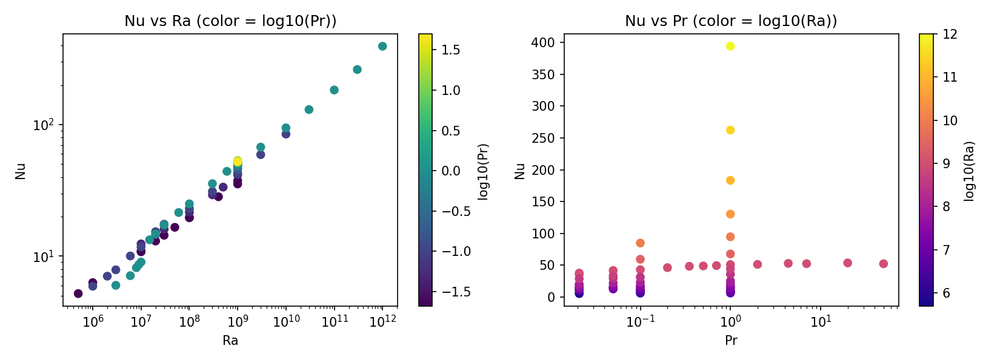
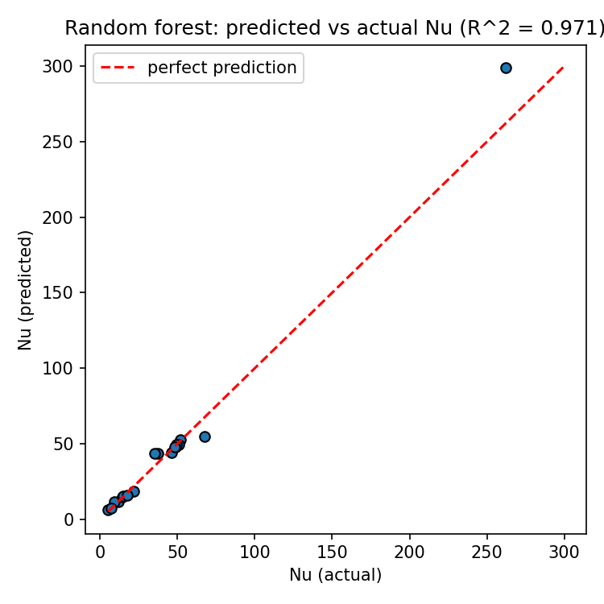
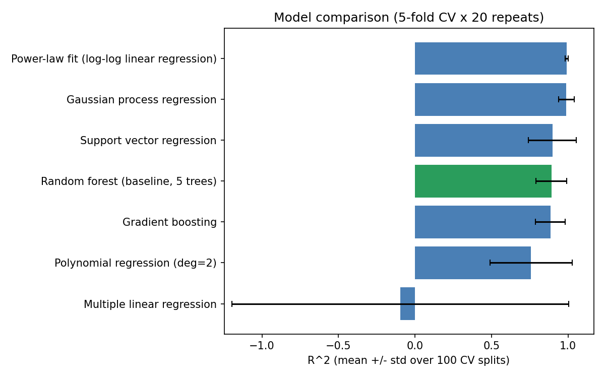
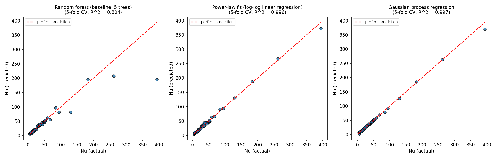

# rayleigh-benard

Machine-learning prediction of the Nusselt number (Nu) from Prandtl (Pr) and
Rayleigh (Ra) numbers in 2D Rayleigh-Bénard convection, following Sec. 3.3
("Forecasting heat transport using machine learning") of Shreshthi & Pandey's
paper.

```
rayleigh-benard/
├── references.md              # quick plain-text citation list
├── docs/
│   ├── data_sources.pdf       # full provenance: reproduces every source
│   │                          #   table, highlights what was kept, comments
│   │                          #   on what was excluded and why
│   └── data_sources.tex       # LaTeX source for the above
├── papers/                    # PDFs of the papers referenced above
├── data/
│   └── nu_dataset_model.csv   # Pr, Ra, Nu only - nothing else. Load this for training.
├── notebooks/
│   └── analysis.ipynb         # EDA + random forest regression, following the paper's method
├── scripts/
│   ├── baseline_random_forest.py  # standalone version of the paper's method
│   └── compare_models.py          # baseline vs. 6 other regression methods
├── docs/
│   └── method_comparison.md   # results + discussion of the method comparison
└── results/
    ├── eda_scatter.png
    ├── predicted_vs_actual.png
    ├── baseline_random_forest.png
    ├── model_comparison.png
    └── top_methods_predicted_vs_actual.png
```

## Data

**[`data/nu_dataset_model.csv`](data/nu_dataset_model.csv)** is the only file
needed for training: 59 rows, columns `Pr, Ra, Nu`, nothing else. Load this
directly — no cleaning needed.

Where it comes from and why each row is (or isn't) in it is documented in
full in **[`docs/data_sources.pdf`](docs/data_sources.pdf)** (compiled from
[`docs/data_sources.tex`](docs/data_sources.tex)): it reproduces every source
table from the cited papers, color-highlights which rows were kept vs.
excluded, and comments on why. Short version:

All 59 rows describe the *same physical setup*: a closed 2D square box
(Γ=1), no-slip walls, isothermal top/bottom plates, adiabatic sidewalls,
solved with the same spectral-element code — confirmed because several
source papers report the exact same Nu (to the decimal) at the same Pr, Ra,
meaning they're literally the same simulation reused across papers.

Left out on purpose (row-by-row reasoning in `docs/data_sources.pdf`):
resolution-check re-runs (same physical point, re-run at finer mesh - not new
data), exact cross-paper duplicates (counted once), and the "RBC-P" table
from Pandey/Tiwari/Sreenivasan (2026) - a genuinely different physical
configuration (different solver, likely different domain) used for a
1D/2D/3D/4D comparison, not this project's question.

2 of the 5 papers cited in Sec. 3.3 (van der Poel 2013, Zhang & Zhou 2024 —
see [`references.md`](references.md)) aren't in the dataset yet — couldn't
get either through open-web access. Re-run everything below once they're
added.

## Method comparison

`scripts/compare_models.py` checks the paper's random forest against 6 other
methods using repeated 5-fold cross-validation (100 train/test splits per
method, not just one — see `docs/method_comparison.md` for why that matters
here):

| Method | mean R² | std |
|---|---|---|
| Power-law fit (`Nu = 0.087·Ra^0.303·Pr^0.023`) | **0.991** | 0.009 |
| Gaussian process regression | 0.989 | 0.052 |
| Support vector regression | 0.898 | 0.157 |
| Random forest (paper's method, 5 trees) | 0.891 | 0.100 |
| Gradient boosting | 0.885 | 0.097 |
| Polynomial regression (deg=2) | 0.758 | 0.269 |
| Multiple linear regression | -0.096 | 1.101 |

A physics-motivated power law comes out both best and most stable, and the
random forest baseline itself drops to 0.891 ± 0.100 once cross-validated —
a single lucky 70/30 split had made it look like 0.971 (see `analysis.ipynb`
and `baseline_random_forest.py`, which still report that single-split number
for comparison with the paper). Full reasoning behind each method, and why
the random forest specifically underperforms, is in
**[`docs/method_comparison.md`](docs/method_comparison.md)**.

## Results

All plots below are produced by the scripts/notebook in this repo, not
hand-drawn — regenerate any of them by re-running the corresponding script.

**Raw data, before any model touches it** — Nu vs. Ra and Nu vs. Pr. Confirms
the expected trend (Nu grows with Ra) and shows Ra matters far more than Pr
in this range.



**Baseline random forest** (paper's method: 5 trees, single 70/30 split) —
predicted vs. actual Nu on the 18 held-out points, R² = 0.971.
`baseline_random_forest.png` is the same plot from the standalone script,
confirming it reproduces the notebook exactly.



**The real comparison** — mean R² ± std across 100 cross-validation splits,
for all 7 methods (same numbers as the table above). This is the number to
trust, not the single-split R² above.



**Why the random forest loses** — predicted vs. actual for the random
forest, the power-law fit, and the Gaussian process side by side (5-fold
CV). The random forest systematically underpredicts the handful of
highest-Nu points, because trees can't extrapolate past values seen in
training; the power-law fit and GP don't have that problem.


